# Digit Recognition Neural Network in R 

In this tutorial, we will learn how to create a Web Application to recognize handwritten digits using Neural Networks on R in Watson Studio. For this tutorial, we will be utilizing MNIST database which is the large database of handwritten digits commonly used in Machine Learning.

## Prerequisites
- An [IBM Cloud](https://cloud.ibm.com/registration/trial?utm_medium=OSocial&utm_source=Internal+Influencer&utm_content=000039JL&utm_term=10010797&utm_id=NA-Mostafa-Abdelaleem-T2-DigitRecognitionNeuralNetworkinRCodeProject-2021-10-31) account.
- [IBM Cloud Pak for Data](https://www.ibm.com/products/cloud-pak-for-data)
- A working knowledge of [R Programming Language](https://www.rstudio.com/)

## Estimated Runtime
It should take you approximately 45 minutes to complete this tutorial.

## Steps
[1. Create your IBM Cloud account and access IBM Cloud Pak for Data as a Service](#create-ibm-cloud-account-and-access-ibm-cloud-pak-for-data-as-a-service) </br>
[2. Create a new project](#create-a-new-project) </br>
[3. Launch RStudio Environment IDE](#launch-rstudio-environment-ide) </br>
[4. Add the files to your project](#add-the-files-to-your-project) </br>

## Create IBM Cloud account and access IBM Cloud Pak for Data as a Service
1. Sign in to [IBM Cloud](https://cloud.ibm.com/registration/trial?utm_medium=OSocial&utm_source=Internal+Influencer&utm_content=000039JL&utm_term=10010797&utm_id=NA-Mostafa-Abdelaleem-T2-DigitRecognitionNeuralNetworkinRCodeProject-2021-10-31).
2. Search for IBM Watson® Studio.
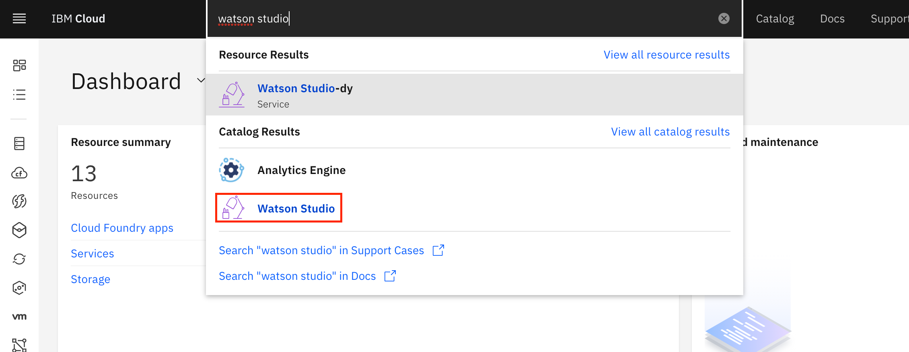
3. Create the service by selecting the region and pricing plan, then click **Create**.
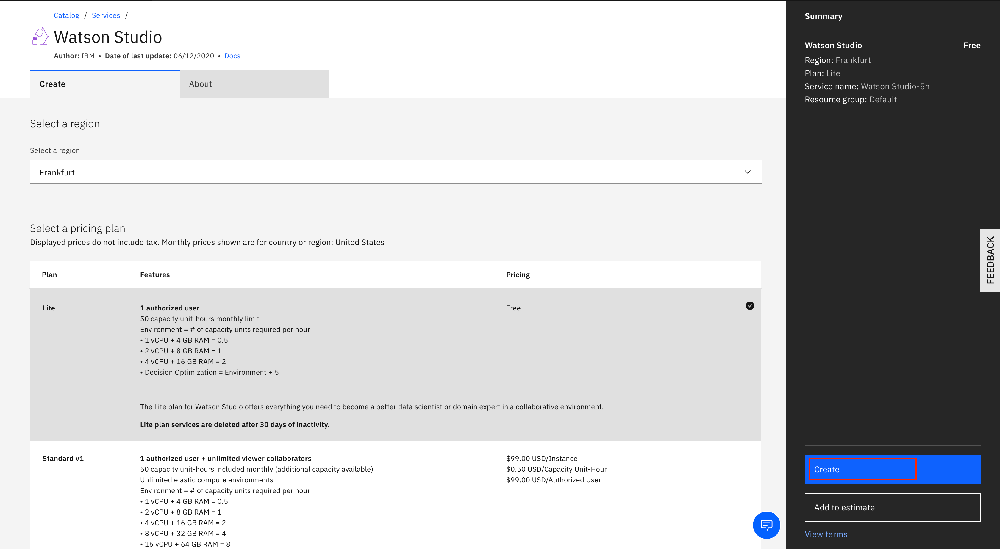

## Create a new project
1. Start the Watson Studio service.
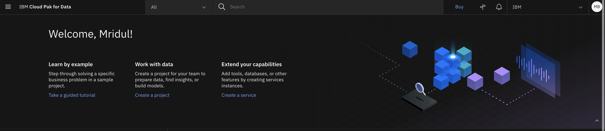
2. Click Create a project and Create an empty project. Make sure that you name your project and add a storage service, then click **Create**.
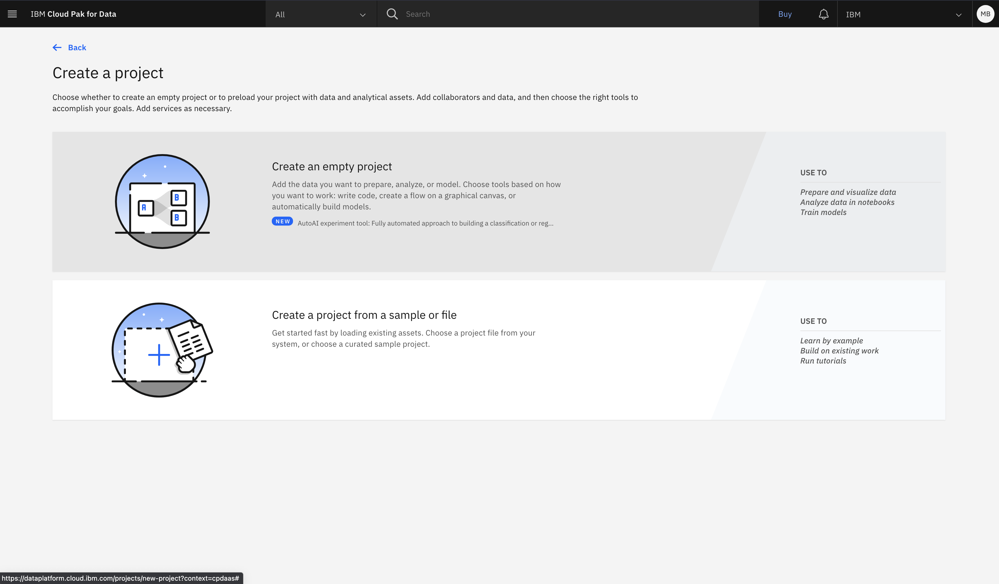
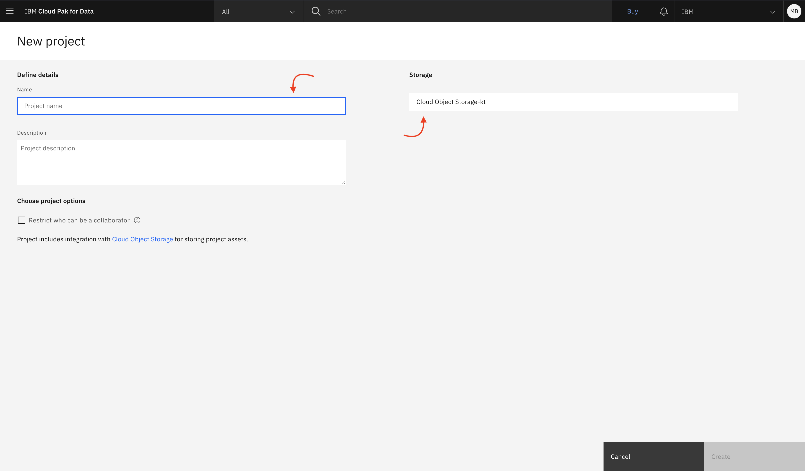

## Launch RStudio Environment IDE
1. Go to **Assets** and click on **Launch IDE** and Select **RStudio**.
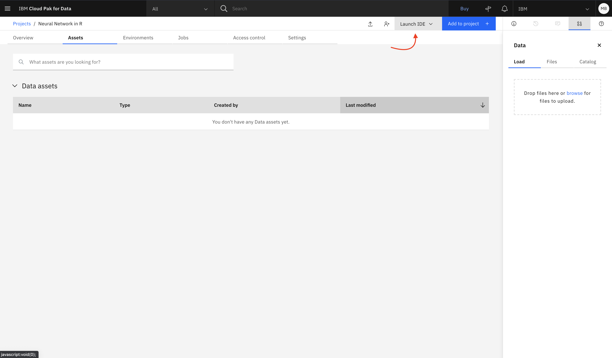
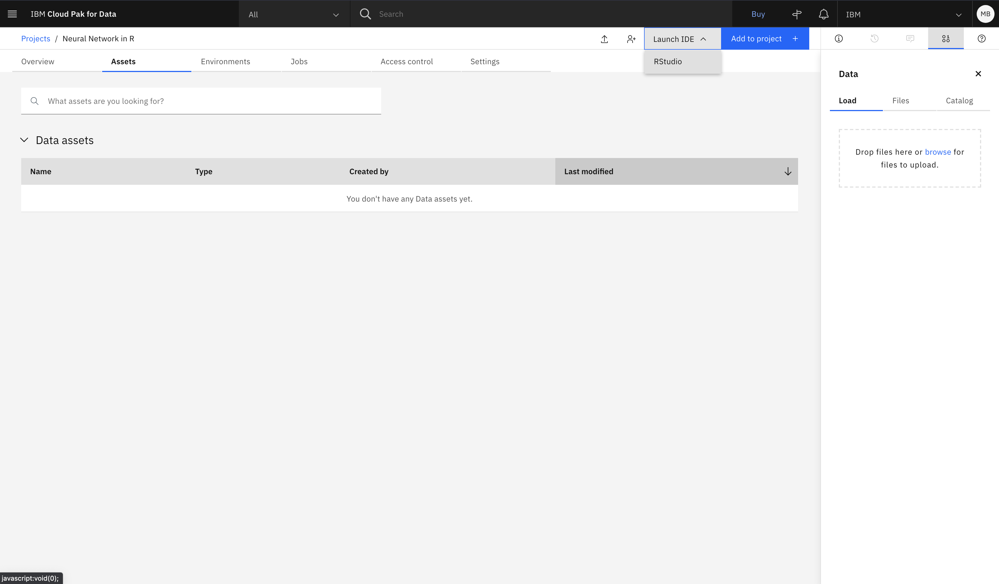

2. Select **Default RStudio XS (2 vCPU and 8 GB RAM)** runtime and click on **Launch**.
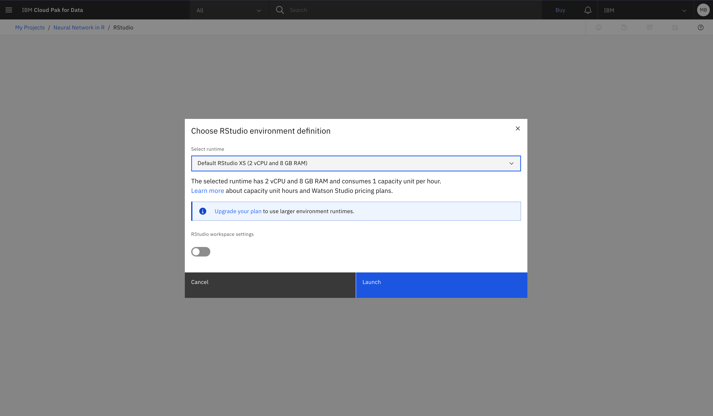
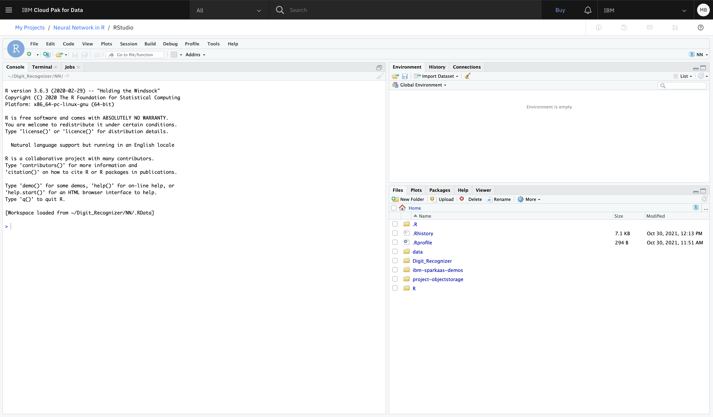

## Add the files to your project
1. Click on **New Folder** icon on under **Files** on the Right-hand side bottom.
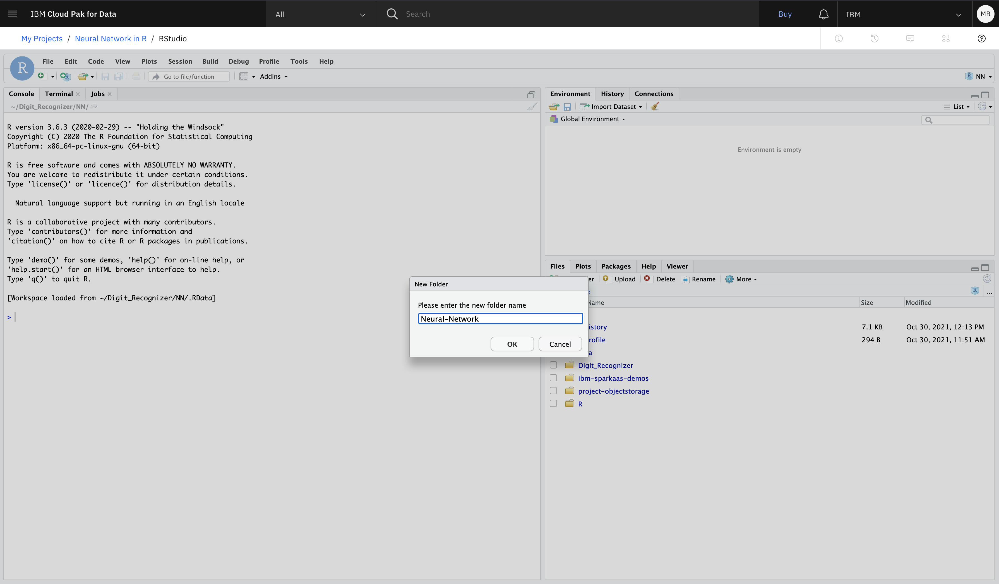
2. Open the newly created folder and upload the zip folder of the GitHub Repository from the following URL. <br/>
`Insert Public GitHub Repository Link`
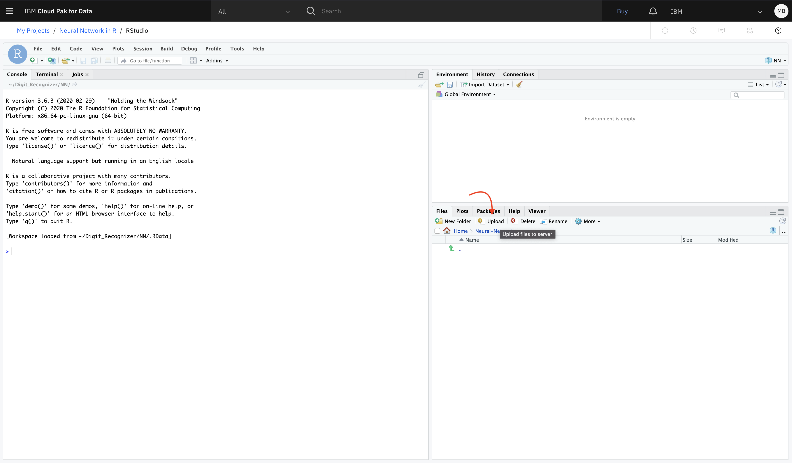
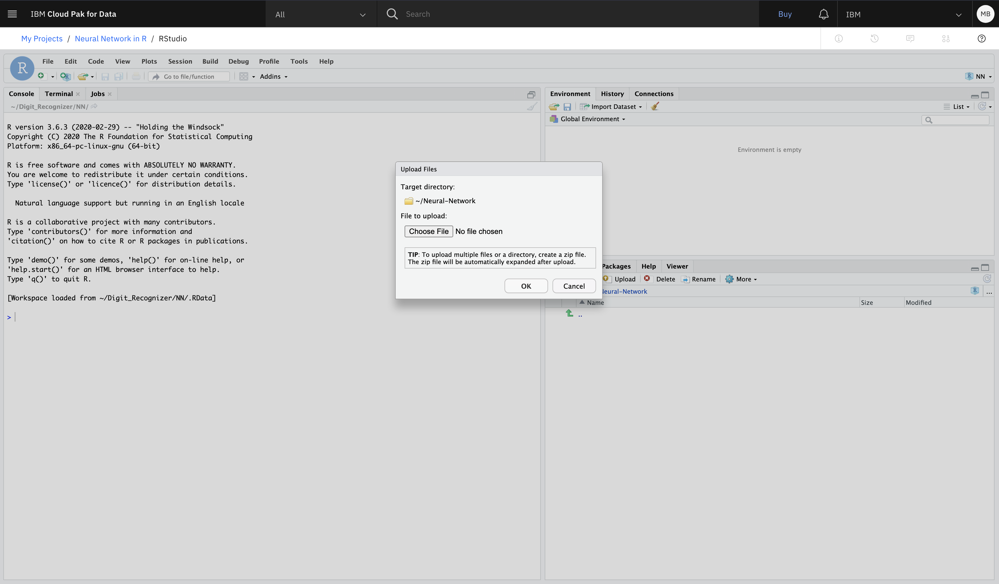
3. Click on **More** and select **Set As Working Directory**.
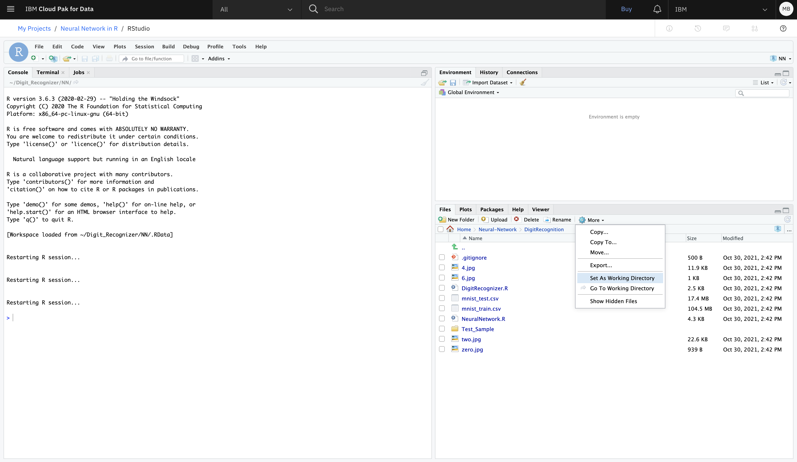
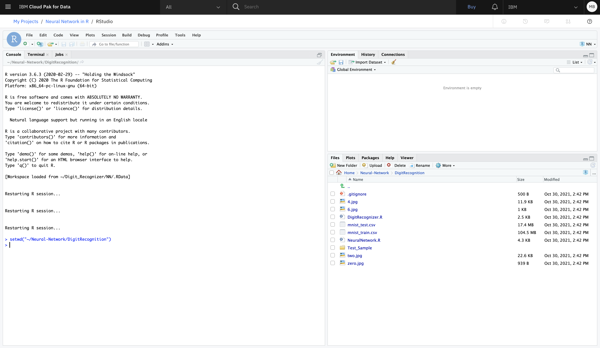
4. Double-click and open **neuralNetwork.R** file from the uploaded files by double-clicking on it. Click on **Run** and execute each line individually, wait for the arrow head to appear before clicking on **Run** to execute the next line.
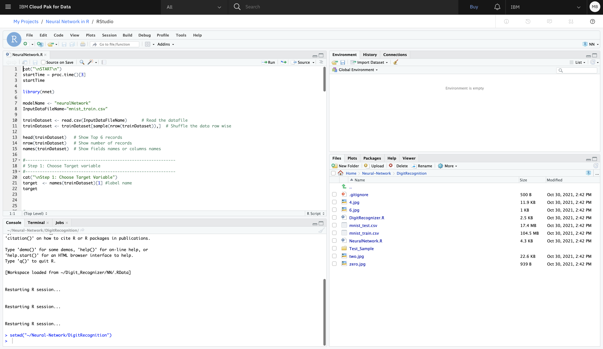
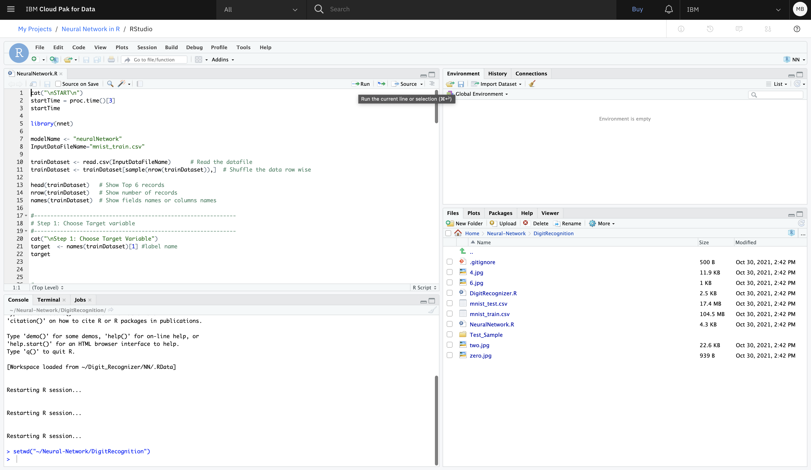
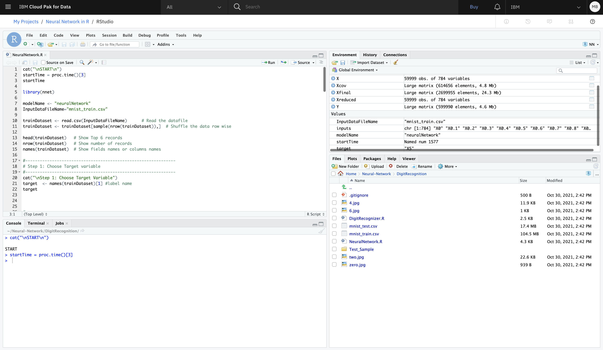
5. After training the Neural Network, we can now run the Web Application to recognize Handwritten Digits. Before that we need to install some packages. Enter the following commands in Console. <br/>
**Installing shiny package**
```
install.packages(“shiny”) 
```
**Installing nnet package**
```
install.packages(“nnet”) 
```
**Installing EBImage package**
```
install.packages(“BiocManager”) 
BiocManager::install(“EBImage”) 
```
Open the **DigitRecognizer.R** file from the uploaded files by double-clicking on it. Click on **Run App** to Run the Web Application. You can upload the sample images from the Sample-Images folder in the GitHub Repository downloaded earlier on your computer to test the Application.
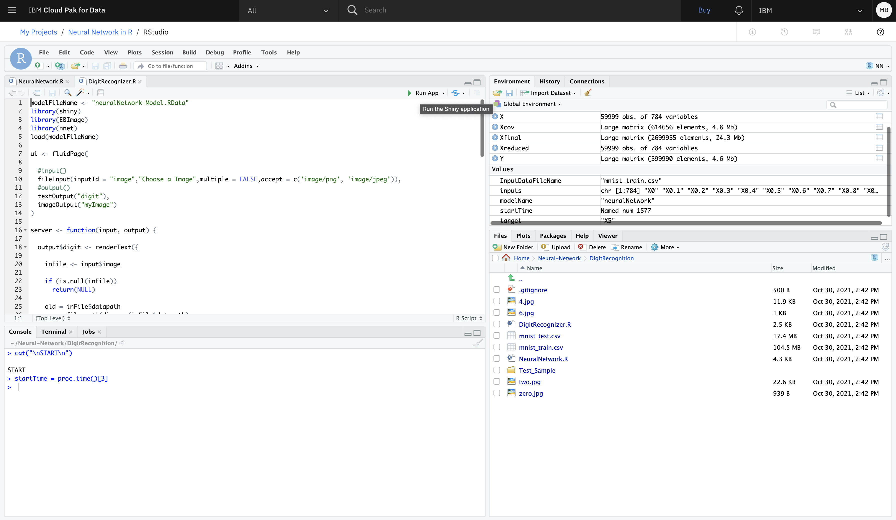
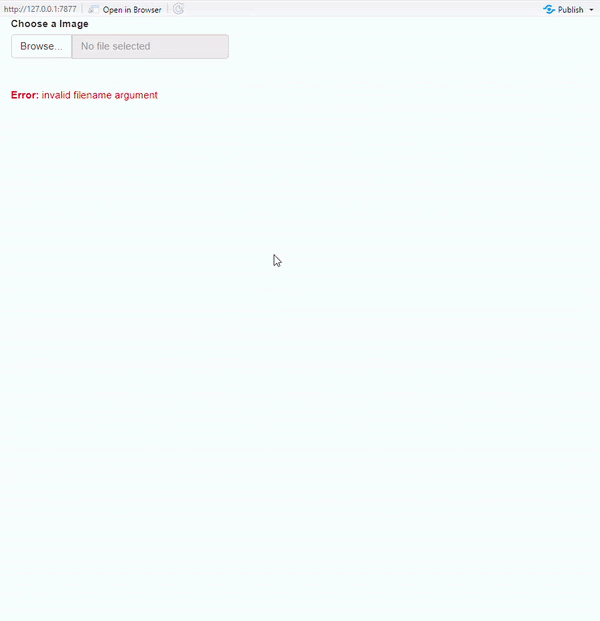
  

## Conclusion
In this tutorial, we learned how to create and visualize a neural network that takes in a dataset and trains a model to predict outcomes.  
